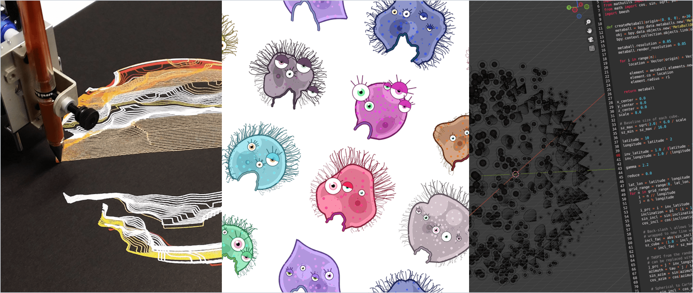

# Kiwi PyCon XI Resources

*Resources for Kiwi PyCon XI presentation, [Generative Art with Python (using py5 and bpy)](https://pretalx.com/kiwipycon-2021/talk/T3Q3HP/)*

**Session slides**: [./slides.pdf](./slides.pdf)

---

## Part #1: py5

Tens of thousands of students, artists, designers, researchers, and hobbyists, use Processing for programming art and prototyping. py5 is a new version of Processing for Python 3.8+ that makes Processing available to the CPython interpreter (using JPype). py5 can do just about everything Processing can, except with Python (instead of Java code), with the added bonus of incorporating popular Python libraries such as numpy and Pillow, and a notebook interface. This session will provide an overview of the py5 coding environment, and examples of the type of artwork one can create.

**py5 examples:** [./part_01_examples_py5](./part_01_examples_py5)

### py5 resources

* [Four py5 modes](http://py5.ixora.io/tutorials/py5-modes/)
* [py5 cheatsheet](https://raw.githubusercontent.com/tabreturn/processing.py-cheat-sheet/master/py5/py5_cc.pdf)
* [py5 examples](https://github.com/py5coding/py5examples)
* [py5 reference](http://py5.ixora.io/reference/)
* [py5 website](http://py5.ixora.io/)
* [GitHub discussions (forum)](https://github.com/py5coding/py5generator)
* [GitHub issues (bugs)](https://github.com/py5coding/py5generator/issues)
* [Processing forum](https://discourse.processing.org/c/processing-py/9)
* [thonny-py5mode](https://github.com/tabreturn/thonny-py5mode)

### Other useful Python-Processing resources

* [Demystifying the Python-Processing Landscape: An Overview of Tools Combining Python and Processing](https://dl.acm.org/doi/10.1145/3532836.3536231)
* [Villares' comprehensive list of resources](https://github.com/villares/Resources-for-teaching-programming#user-content-processing--python-tools-table) for teaching programming for artists, designers, and architects

---

## Part #2: bpy

Blender is open-source software for 3D modelling and animation that can also handle compositing, video editing, and 2D animation. Artists and animators operate Blender using a graphic user interface, but it also features a Python API (via bpy) that can do everything the GUI can and more. That means you can use Python code to draw, animate, and manipulate 3D objects, with a powerful render engine to output your code-generated creations in high-resolution image and video formats. This session includes an introduction to using Blender's code editor, info editor, Python console, developer extras, and assistive scripting features to address 3D objects, spawn, and manipulate them via different attributes and methods.

**bpy examples:** [./part_02_examples_bpy](./part_02_examples_bpy)

### Some useful resources

* [Blender 3.2 Python API Documentation](https://docs.blender.org/api/current/)
* [Jeremy Behreandt's primer on creative coding in blender](https://behreajj.medium.com/creative-coding-in-blender-2-92-a-primer-7ac1b6fec3f)
* [Nikolai Janakiev's collection of blender scripts](https://github.com/njanakiev/blender-scripting)
* [tabreturn's quick intro to Blender creative coding](https://tabreturn.github.io/#blender-reverse)
* ["scripting"-tagged questions on Blenders' StackExchange](https://blender.stackexchange.com/questions/tagged/scripting)

### Some inspiring work

* https://blog.lightprocesses.com
* https://github.com/a1studmuffin/SpaceshipGenerator
* https://ylegall.github.io

---

## Plotter utilities

A few handy Python utilities for working with plotter art files:

* [vpype](https://github.com/abey79/vpype)  
  the Swiss-Army-knife command-line tool for plotter vector graphics
* [vpype-occult](https://github.com/LoicGoulefert/occult)  
  vpype plug-in to remove lines occulted by polygons from SVG files
* [vsketch](https://github.com/abey79/vsketch)  
  a Python generative art toolkit for plotters
